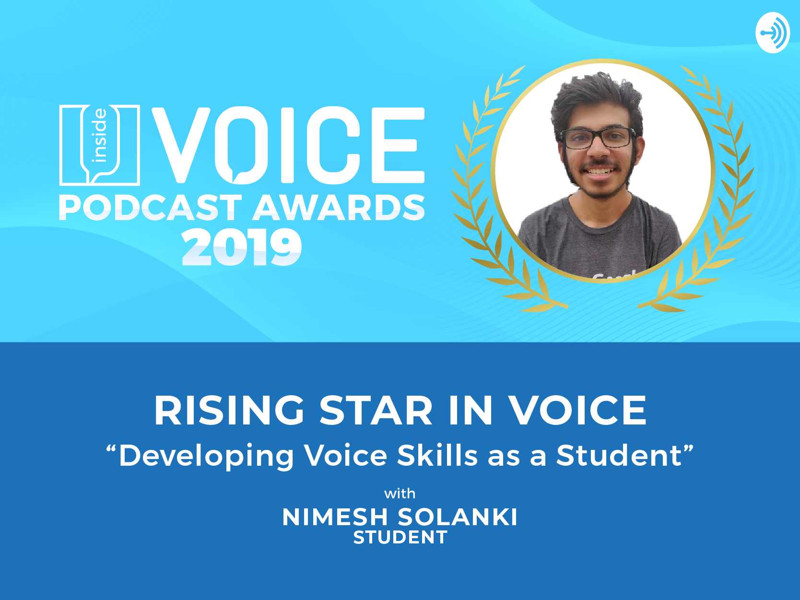

<h1 align="center"><a href="https://podcasts.apple.com/us/podcast/inside-voice/id1447407838">Inside Voice Podcast</a></h1>

<h2 align="center">Episode Name: Developing Voice Skills as a Student</h2>

<a href="https://podcasts.apple.com/us/podcast/developing-voice-skills-as-a-student/id1447407838?i=1000447426808">Listen to the podcast</a> or
<a href="https://www.voicesummit.ai/blog/the-winners-of-the-inside-voice-podcast-awards-are">Read more about it over here</a>

### 🤔 What is this podcast about?

This podcast is about showcasing the creative, inclusive community in voice technology with a focus on educational and innovative content.

### How did you get this opportunity?

Being a `#1 VOICE Ambassador` globally and `scholarship holder` in VOICE Summit 2019 helped
with get this opportunity of speaking at Inside Voice Podcast.

VOICE Summit Team called everyone single scholarship holder on the Podcast.

### How did you win an award 🏆?

Only the most popular, highly downloaded episode and one who contributed to voice-tech community won the award.

### 🏆 'Rising Star in Voice' Award Winner

As a result of speaking at this podcast, I won the award 'Rising Star in Voice'.

