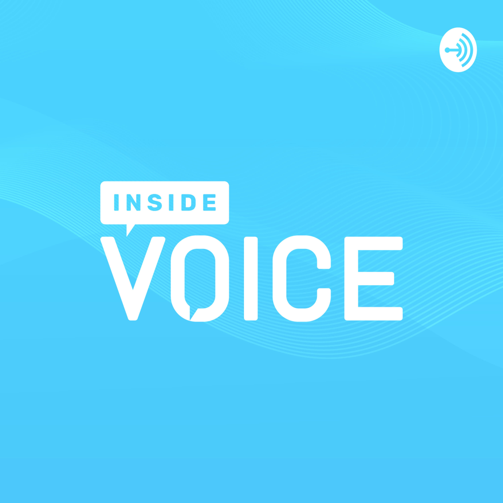

# Inside Voice Podcast

## 🤔 What is this podcast about?
This podcast is about showcasing the creative, inclusive community in voice technology with a focus on educational and innovative content.

Being a `#1 VOICE Ambassador` globally and `scholarship holder` in VOICE Summit 2019 helped 
with get this opportunity of speaking at Inside Voice Podcast.

VOICE Summit Team called everyone single scholarship holder on the Podcast. But only the most popular, highly downloaded episode and one who contributed to voice-tech community won the award. 

### 'Rising Star in Voice' Award Winner
As a result of speaking at this podcast, I also won the award 'Rising Star in Voice'.

Episode Name: Developing Voice Skills as a Student

[Listen to the podcast](https://podcasts.apple.com/us/podcast/developing-voice-skills-as-a-student/id1447407838?i=1000447426808)

[Read more about it over here](https://www.voicesummit.ai/blog/the-winners-of-the-inside-voice-podcast-awards-are)

