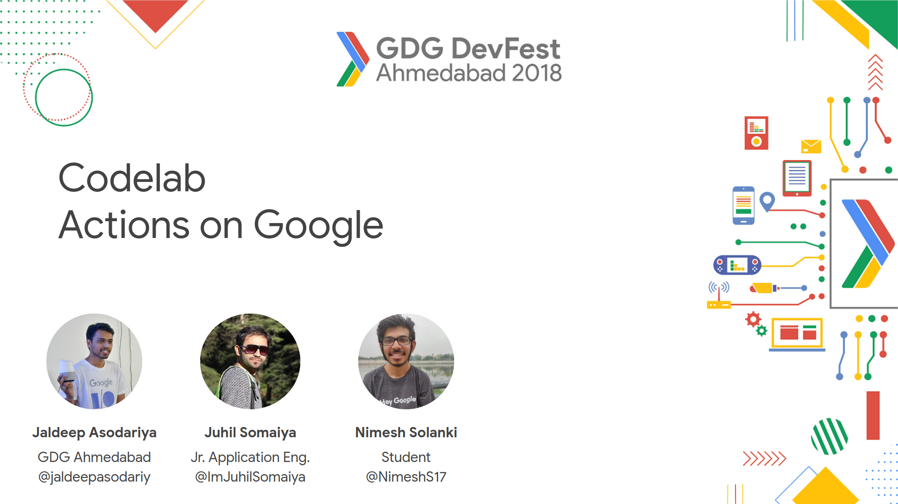
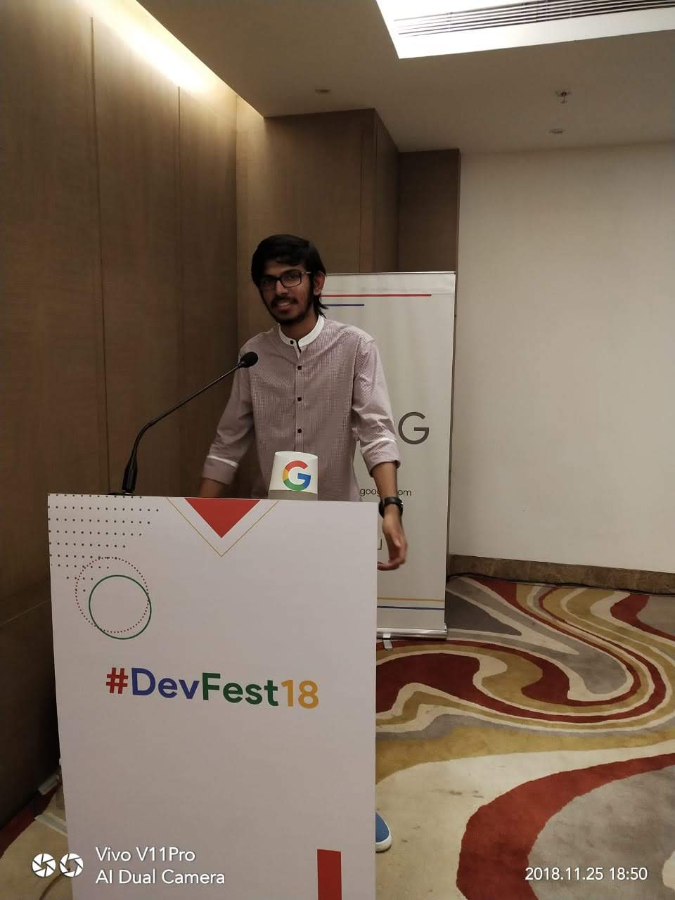
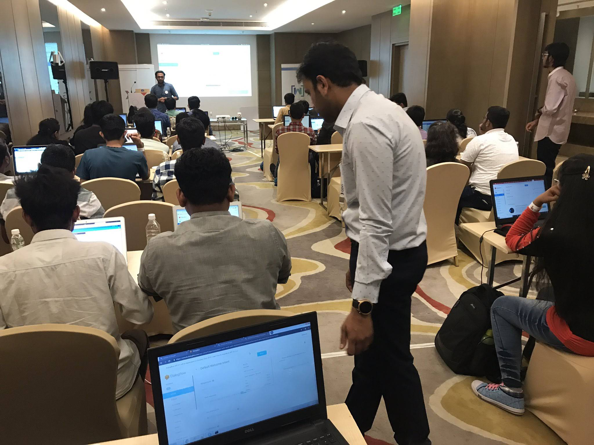
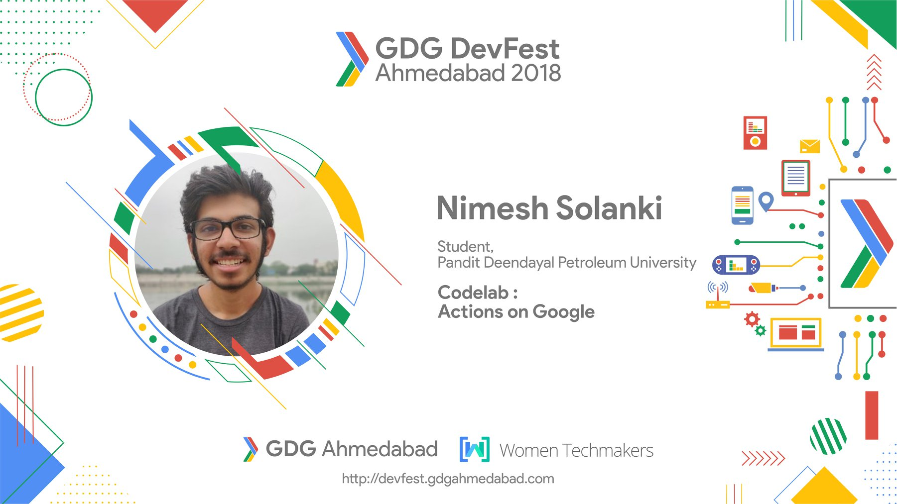
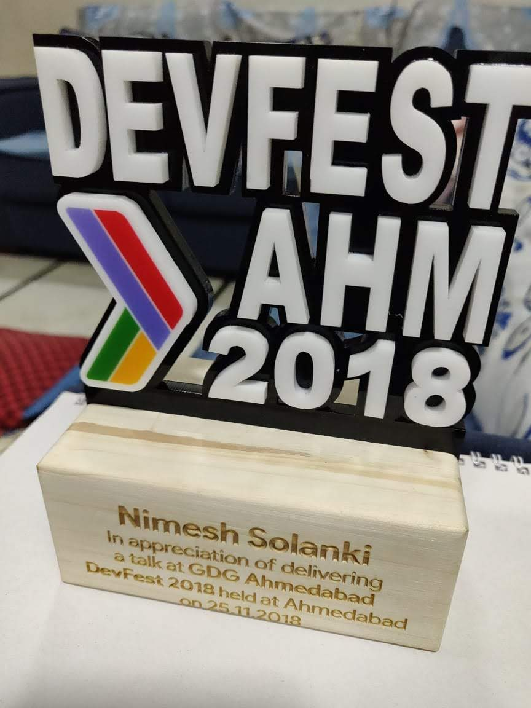
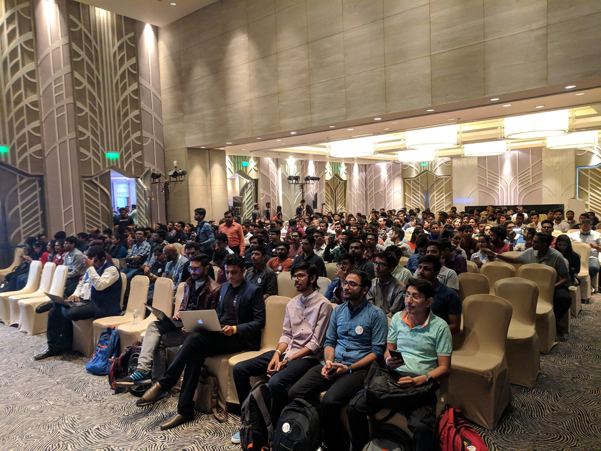
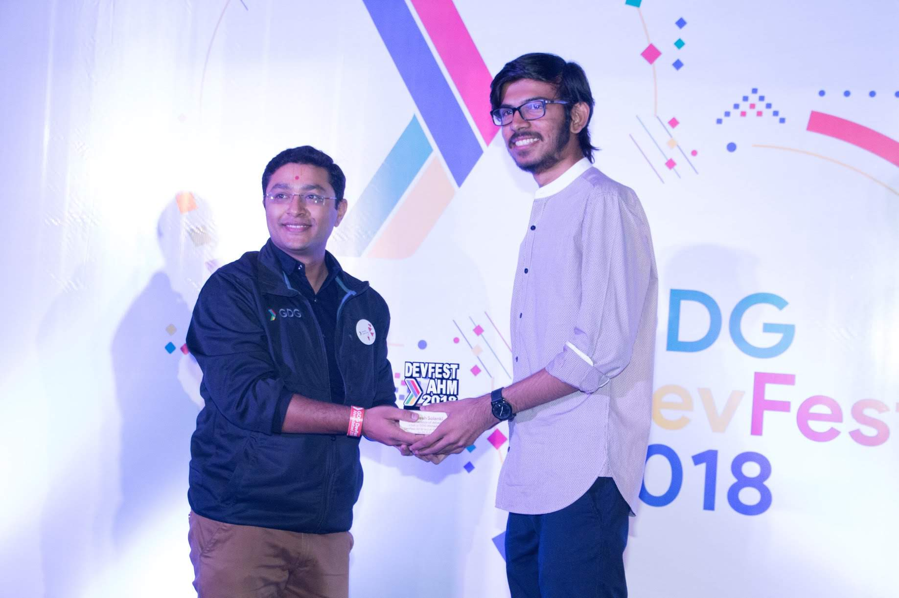
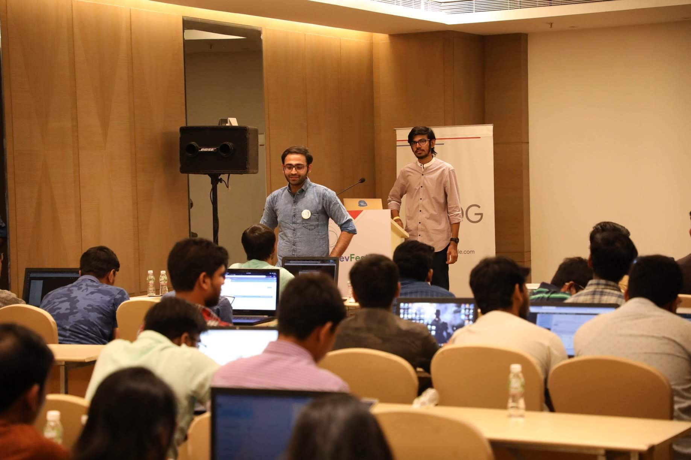
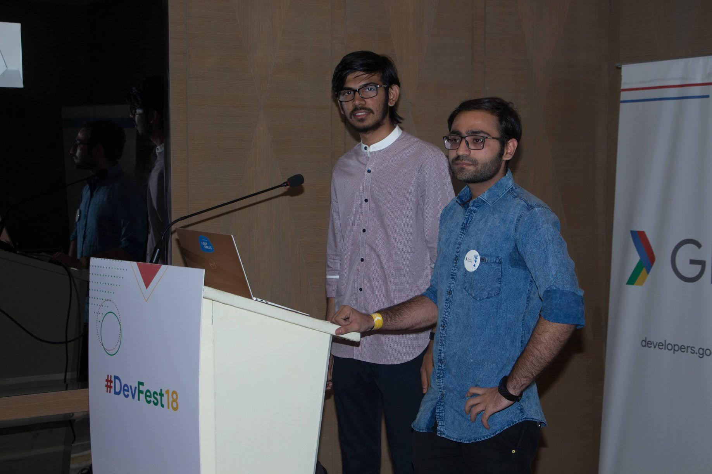

<h1 align="center"><a href="http://devfest.gdgahmedabad.com/">GDG Devfest Ahmedabad 2018 </a> </h1>
<h2 align="center">Organized by <a href="https://www.meetup.com/GDG-Ahmedabad/">GDG Ahmedabad</a>, <a href="https://twitter.com/wtmahmedabad">WTM Ahmedabad</a> and <a href="https://twitter.com/GDGCloudAhm">GDG Cloud Ahmedabad</a></h2>

<a href="https://speakerdeck.com/nimeshs17/actions-builder-101">Link to Slides</a>

    The very first talk of my life.
    I was a co-speaker along with Juhil. Jaldeep sir was the lead speaker.

### Date of Event: 25th November 2018.

### 🤔 What was your talk about?

I talked about some of the best practices for Voice User Interface Design. By working in voice-tech I learned and experienced some best practices which makes voice user interface much easy to use and which doesn't sound like a machine.

### How was the entire session divided?

The way we divided the whole talk was something like this.
Jaldeep sir introduced Google Assistant to the participants.
Juhil Started with the Codelab - 1.
And then my part was to cover the codelab-2

### ✨ How did you get this opportunity?

During that time, I finished developing a [Google Action](https://assistant.google.com/services/a/uid/000000e634a014e0) for my University and [shared it on Twitter](https://twitter.com/NimeshS17/status/1030674391971942401). That's when I saw GDG Kolkata developed an Action for their DevFest. I thought of doing the same for GDG Ahmedabad. I contacted the organizers of GDG Ahmedabad DevFest, they really liked the idea and asked to implement it. [Once the action was developed](https://assistant.google.com/services/a/uid/000000865b9d1f60), I showed it to the GDG Ahmedabad Team, and they really liked it a lot. After few days I got a call from the organizers asking me to do a codelab session during the DevFest 2018.
That's how I got the opportunity to speak.

### 👨‍💻 Which codelab did you cover?

I covered the Build Actions using DialogFlow Codelab Level 2.

### ⏲️ How long was the session?

It was 2hrs session.

### 👨‍👩‍👧‍👦 How many people showed interest in attending the session and how many actually showed up at the event?

I was shocked to see the overwhelming response from all the people in the community.
More than `150 people` registered and attended the DevFest out of which `50+ participants` attended the session.

### Photos

