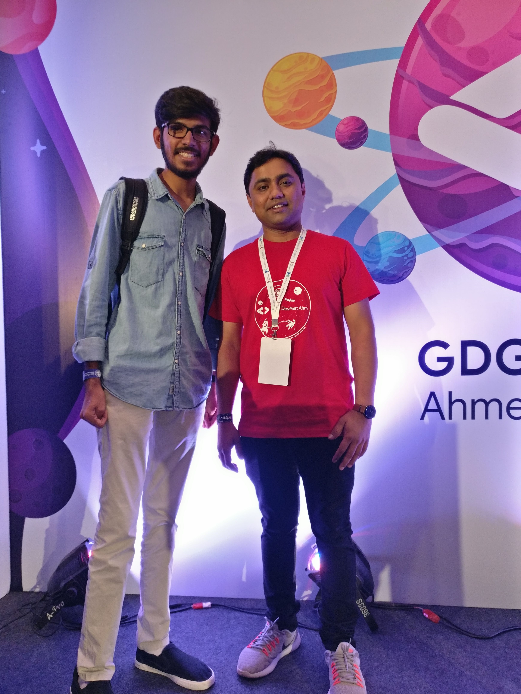

<h1 align="center"><a href="http://devfest.gdgahmedabad.com/">GDG Devfest Ahmedabad 2019 </a> </h1>
<h2 align="center">Organized by <a href="https://www.meetup.com/GDG-Ahmedabad/">GDG Ahmedabad</a>, <a href="https://twitter.com/wtmahmedabad">WTM Ahmedabad</a> and <a href="https://twitter.com/GDGCloudAhm">GDG Cloud Ahmedabad</a></h2>

<a href="https://speakerdeck.com/nimeshs17/best-practices-of-vui-design">Link to Slides</a> 
or <a href="https://www.youtube.com/watch?v=JMbSDu80TlU">Watch recording now</a>

### Date of Event: 12th October 2019.

### 🤔 What was your talk about?

I talked about some of the best practices for Voice User Interface Design. By working in voice-tech I learned and experienced some best practices which makes voice user interface much easy to use and which doesn't sound like a machine. 

### ✨ How did you get this opportunity?

I had applied to speak when CFP (Call For Proposal) was annouced. Based on my previous experiences, Organizers of GDG Ahmedabad selected me to deliver this talk.

### ⏲️ How long was the session?

It was 30 mins session.

### 👨‍👩‍👧‍👦 How many people showed interest in attending the session and how many actually showed up at the event?

I was shocked to see the overwhelming response from all the people in the community.
More than `150 people` registered and attended the DevFest out of which `30+ participants` attended the session.

### Photos

