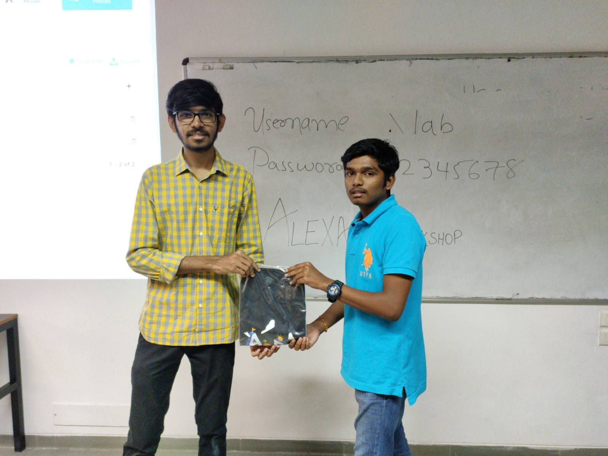
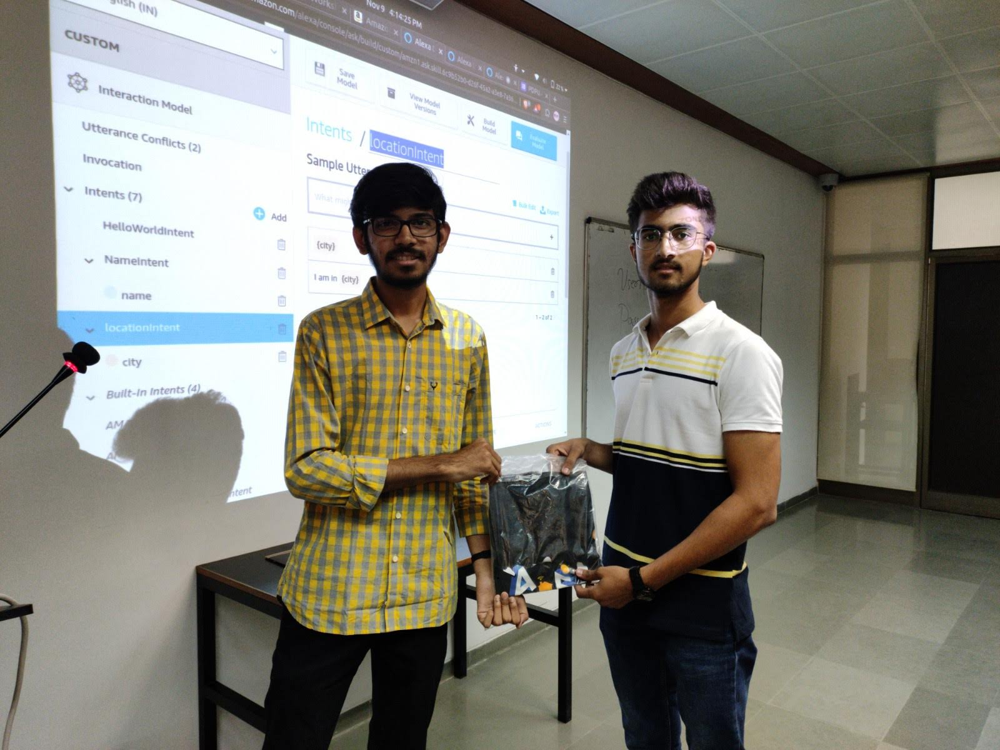
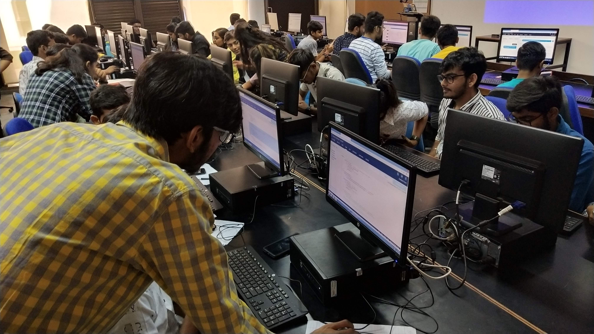
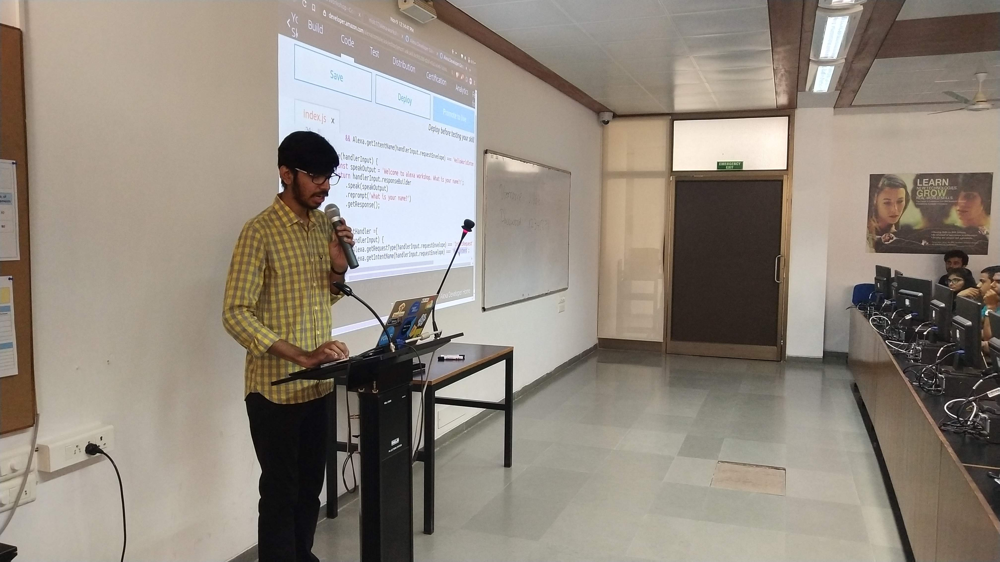
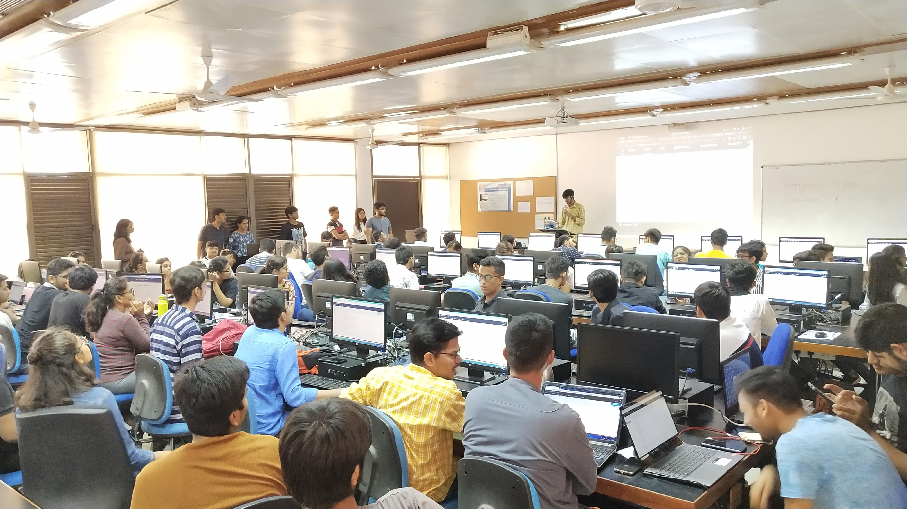

# Alexa Workshop at PDPU.

### 🤔 What was this workshop about?
This workshop was about introducing students to digital and smart voice assistant called Amazon Alexa. Started from the very basics I explained all about developing skills for Amazon Alexa. How to use Alexa-hosted backend to write your own logic for the Alexa skill. 

### ✨ How did you get this opportunity?
Encode(Programming club of PDPU) approached me to conduct a session on Alexa skill development.

### 😊 How was the workshop?

- #### From the speaker's point of view:  
  The quality of the workshop could have been better if I had more moderators who could guide the participants when they were stuck at any step or were lagging.

  I had to individually go to each participant and solve their problem. So I was able to cover less content.

- ### From the participant's point of view
  Feedback received from the participants can be found over [here](https://docs.google.com/spreadsheets/d/1p8Cimgfyx7h6OLT4MlZBwqEPJAA_j9f6co9xi6re5Ko/edit?usp=sharing).
  Overall it was good and everyone enjoyed it a lot!

### 💰 How much did you charge for the workshop?

Zero. Zip. Zilch. Nada. Nothing.

As a speaker, I didn't charge anything for conducting this session.
But the univeristy did, this workshop was a part of Tech-Fest of PDPU. So the entry fees for this event set by the university was ₹130.

😎`In fact, I got swags for all the participants from the Amazon Alexa India Team.`

### 👨‍👩‍👧‍👦 How many participants actually attended the workshop till the very end?

Number of people attended the workshop including the Encode Committee members were more than 100.

### Photos

