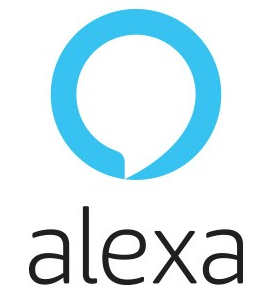
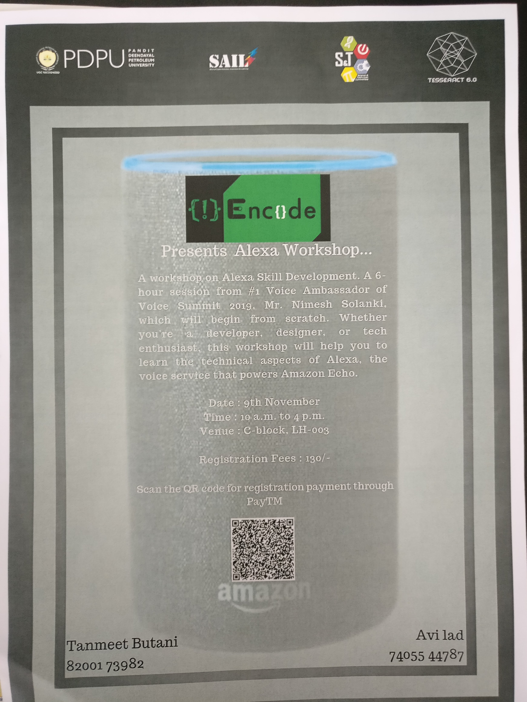

# Workshops

## Alexa Skill Development Workshop organized by Encode at [PDPU, Gandhinagar](http://pdpu.ac.in/).

I was invited to conduct a workshop on Alexa Skill development by EnCode (programming club of Pandit Deedayal Petroleum University).

[Link to Slides](https://speakerdeck.com/nimeshs17/alexa-workshop-pdpu-2019)